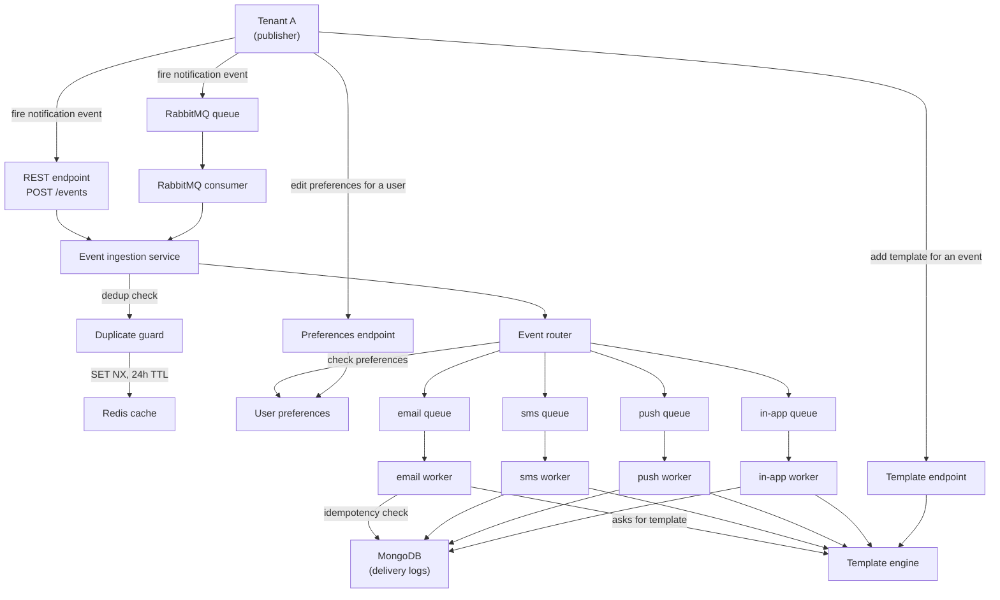
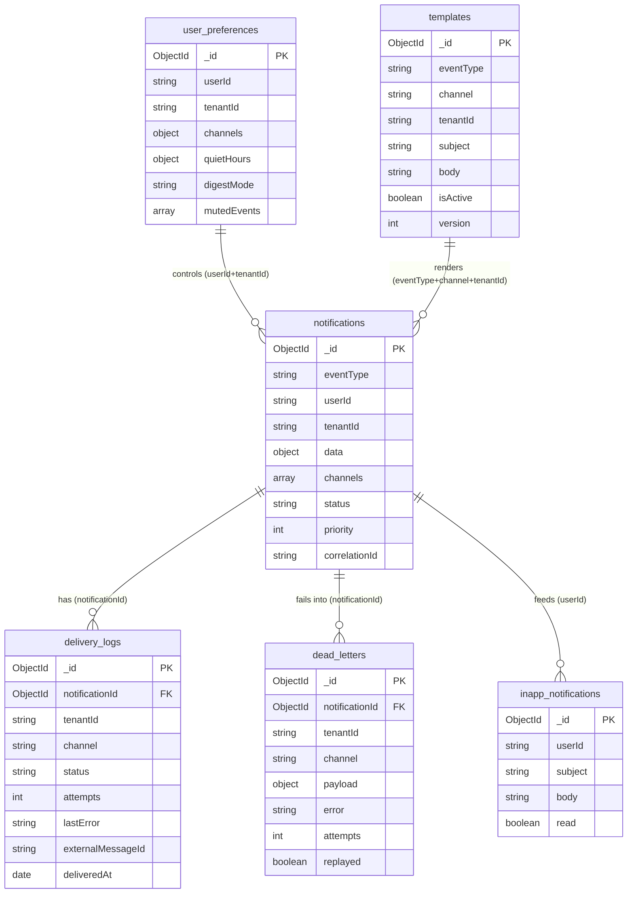

# Event-Driven Notification Engine

A production-grade, multi-tenant, event-driven notification microservice built with **NestJS + TypeScript**. It consumes domain events (via RabbitMQ or REST), applies per-user delivery preferences, renders templates, and delivers multi-channel notifications (email, SMS, push, in-app) with retry logic, dead-letter queues, digest batching, delivery tracking, and analytics.


> The application lives in [`notification-engine/`](notification-engine/). Run all commands from that directory.

## Features

- **Event ingestion** — RabbitMQ topic consumer + REST endpoint, with event-level idempotency (Redis `SET NX`).
- **Preference-based routing** — per-user channel opt-out, quiet hours (timezone-aware), muted events (wildcards), and priority override (HIGH/CRITICAL bypasses quiet hours).
- **Per-channel queues** — isolated BullMQ queues (email, SMS, push, in-app) for fault isolation, each with its own retry policy.
- **Retry, error classification, and DLQ** — transient vs permanent error classification, exponential/fixed backoff, opossum circuit breaker, and a dead-letter queue with replay/discard admin API.
- **Template engine** — Handlebars templates with two-layer caching (Redis + in-memory) and per-tenant/per-channel versioning.
- **Delivery tracking** — every attempt logged, parent notification status rolled up (SENT / PARTIAL / FAILED), send-level idempotency guard.
- **Analytics** — per-channel delivery rate, failure rate, and average delivery time; exposed via REST + an SSE live stream.
- **Digest batching** — hourly/daily email digests with a Redis `SET NX` distributed lock so only one instance runs the cron in a multi-instance deployment.
- **Multi-tenancy** — `tenantId` on every document for row-level isolation.

## Architecture



**Flow:** a tenant fires an event (RabbitMQ or REST) → the ingestion service dedups it via a Redis guard → the router checks the user's preferences and fans the event out to one isolated BullMQ queue per surviving channel → each channel's worker checks the DB for prior delivery (idempotency), renders the template, and delivers. Templates and preferences are managed through their own admin endpoints.

### Key design decisions

- **Per-channel BullMQ queues** for fault isolation — if one provider is down, the other channels keep flowing.
- **`IChannel` interface** — every channel implements `send(payload): Promise<DeliveryResult>`.
- **Provider error classification** — HTTP / network / provider codes mapped to `transient` vs `permanent`. Permanent errors raise BullMQ `UnrecoverableError` to skip remaining retries and go straight to the dead-letter store.
- **Per-channel retry policy** — email 3× exponential, SMS 5× fixed 60s, push 3× exponential, in-app 1 (no retry).
- **Two-layer template cache** — Redis caches template document strings (cross-process); an in-memory `Map` caches compiled Handlebars functions per-process.
- **Persist-then-emit for in-app** — every in-app notification is written to MongoDB first, then best-effort emitted via Socket.io, so offline users still receive their messages.
- **Distributed digest cron** — a Redis `SET NX` lock ensures only one instance runs the hourly/daily digest flush.

## Data Model

MongoDB collections (each has `_id`, `createdAt`, `updatedAt`). Relationships are application-level — MongoDB does not enforce foreign keys.



| Collection | Purpose |
|------------|---------|
| `notifications` | Parent record per ingested event; fans out to one `delivery_logs` row per channel. |
| `delivery_logs` | Per-`(notification, channel)` attempt tracking and outcome. |
| `dead_letters` | Jobs that exhausted retries (or hit a permanent error), with full replayable payload. |
| `templates` | Per-tenant, per-channel, versioned Handlebars templates. |
| `user_preferences` | Per-user channels, quiet hours, digest mode, muted events. |
| `inapp_notifications` | Stored in-app messages (read/unread feed). |

**Enums**

- **ChannelType:** `EMAIL`, `SMS`, `PUSH`, `INAPP`
- **DeliveryStatus** (per channel): `QUEUED`, `PROCESSING`, `DELIVERED`, `FAILED`, `DLQ`
- **NotificationStatus** (parent): `PENDING`, `PROCESSING`, `SENT`, `PARTIAL`, `FAILED`, `SUPPRESSED`
- **EventPriority:** `CRITICAL=1`, `HIGH=2`, `NORMAL=3`, `LOW=4`
- **DigestMode:** `instant`, `hourly`, `daily`

Full details in [`notification-engine/docs/DB_SCHEMA.md`](notification-engine/docs/DB_SCHEMA.md).

## Event Routing

| Event | Channels | Priority |
|-------|----------|----------|
| `user.signup` | Email + In-App | Normal |
| `order.placed` | Email + SMS + In-App | Normal |
| `order.shipped` | SMS + Push | Normal |
| `payment.failed` | Email + SMS | High (bypasses quiet hours) |
| `friend.request` | In-App | Low |
| `weekly.digest` | Email (batched) | Low |

## Tech Stack

| Concern | Technology |
|---------|------------|
| Framework | NestJS + TypeScript (strict) |
| Message broker | RabbitMQ (topic exchange) |
| Job queues | BullMQ + Redis |
| Database | MongoDB + Mongoose |
| Cache / locks | Redis (ioredis) |
| Channels | Email / SMS / Push (simulated), In-App (Socket.io) |
| Scheduling | @nestjs/schedule |
| Testing | Jest + mongodb-memory-server |
| Containerization | Docker + docker-compose |

## Quick Start

The app runs locally; MongoDB, Redis, and RabbitMQ run in Docker. Run from the `notification-engine/` directory.

```bash
# 1. Start infrastructure
docker-compose up -d

# 2. Configure environment
cp .env.example .env

# 3. Install dependencies
npm install

# 4. Seed templates + sample data
npm run seed

# 5. Run the app (watch mode)
npm run start:dev
```

- REST API: `http://localhost:3000/api/v1`
- WebSocket (in-app): port `3001`
- RabbitMQ management UI: `http://localhost:15672` (guest/guest)

### Trigger a notification

```bash
curl -X POST http://localhost:3000/api/v1/events \
  -H "Content-Type: application/json" \
  -d '{
    "eventType": "order.placed",
    "userId": "user123",
    "tenantId": "tenant1",
    "data": { "email": "you@example.com", "phone": "+15551234567", "orderId": "A-100" }
  }'
```

## Key Endpoints

| Method | Path | Description |
|--------|------|-------------|
| POST | `/api/v1/events` | Ingest a notification event |
| GET | `/api/v1/dashboard/stats` | Per-channel delivery analytics |
| GET | `/api/v1/dashboard/stream` | SSE live stats feed |
| GET | `/api/v1/notifications/:userId` | Per-user notification history |
| GET/PUT | `/api/v1/preferences/:userId` | Read / update user preferences |
| POST/GET/PUT/DELETE | `/api/v1/templates` | Template CRUD |
| GET | `/api/v1/dlq` | List dead-lettered jobs |
| POST | `/api/v1/dlq/:id/replay` | Replay a dead-lettered job |
| DELETE | `/api/v1/dlq/:id/discard` | Discard a dead-lettered job |
| GET | `/api/v1/health` | Health check |

## Testing

```bash
npm test                 # all unit + integration tests
npm test -- preferences  # one module
npm run test:cov         # coverage
```

Tests use `mongodb-memory-server`, so no running database is required.

## Roadmap

| Phase | Step | Status |
|-------|------|--------|
| 1 | NestJS + TypeScript foundation | Done |
| 2 | MongoDB + Mongoose schemas | Done |
| 3 | RabbitMQ ingestion | Done |
| 4 | Event validation & routing | Done |
| 5 | BullMQ per-channel queues | Done |
| 6 | Channel workers (Email / SMS / Push / In-App) | Done |
| 7 | Template engine + Redis caching | Done |
| 8 | Retry + classified errors + DLQ + circuit breaker | Done |
| 9 | User preferences (opt-in/out, quiet hours) | Done |
| 10 | Preference-based routing pipeline | Done |
| 11 | Delivery tracking + analytics | Done |
| 12 | Analytics + SSE dashboard | Done |
| 13 | Digest batching + distributed cron | Done |
| 14 | Docker, Swagger, structured logging | In progress |
| 15 | Comprehensive test suite (Jest + e2e) | In progress |
| 16 | CI/CD with GitHub Actions | Planned |
| 17 | Auth, HMAC verification, rate limiting | Planned |
| 18 | Field-level encryption + GDPR | Planned |
| 19 | Multi-tenancy with row-level isolation | Planned |
| 20 | k6 load testing | Planned |
| 21 | Schema registry + contract testing | Planned |
| 22 | Kubernetes + Helm + Terraform | Planned |
| 23 | ADRs + system design doc | Planned |

## License

MIT
