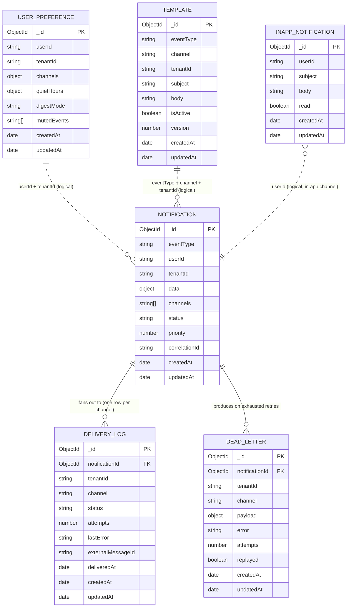

# Database Schema

MongoDB collections used by the Notification Engine, as implemented in
`src/**/schemas/*.schema.ts`. Every collection has the implicit unique `_id`
(MongoDB ObjectId) plus `createdAt` / `updatedAt` from `{ timestamps: true }`
unless noted otherwise.

> All ids referenced below (e.g. `notificationId`) are MongoDB `ObjectId`s.
> `_id` is **always unique** within a collection — but two *different* events
> ingested twice produce two notifications with two different `_id`s, so
> de-duplication also requires an ingestion-level idempotency key (not just the
> `_id`).

---

## ER Diagram

> Relationships are by reference fields (`notificationId`) or logical keys
> (`userId` / `tenantId` / `eventType`). MongoDB does not enforce foreign keys —
> these are application-level joins.

---

## Collections

### `notifications`
The parent record created per ingested event. Fans out to one `delivery_logs`
row per channel.

| Field           | Type              | Notes |
|-----------------|-------------------|-------|
| `_id`           | ObjectId          | = `notificationId` used everywhere else |
| `eventType`     | string (required) | e.g. `order.placed` |
| `userId`        | string (required) | |
| `tenantId`      | string (required) | row-level tenant isolation |
| `data`          | object            | raw event payload, default `{}` |
| `channels`      | string[] (ChannelType) | which channels this notification targets |
| `status`        | enum NotificationStatus | default `PENDING`; set to `SUPPRESSED` when preference routing drops every channel (muted / all opted-out / quiet hours) |
| `priority`      | number (EventPriority)  | default `NORMAL` |
| `correlationId` | string (optional) | trace id across logs |

> When `status = SUPPRESSED`, `channels` is the post-filter result (often empty)
> and no `delivery_logs` rows are created — the event was recorded but never
> dispatched. See `PreferenceRouter` (Step 10).

**Indexes**
- `{ eventType: 1 }`, `{ userId: 1 }`, `{ tenantId: 1 }`, `{ status: 1 }` (single-field)
- `{ userId: 1, createdAt: -1 }`
- `{ tenantId: 1, status: 1, createdAt: -1 }`
- `{ eventType: 1, tenantId: 1 }`

---

### `delivery_logs`
One row per `(notification, channel)`. Tracks attempts and the per-channel
delivery outcome.

| Field               | Type              | Notes |
|---------------------|-------------------|-------|
| `_id`               | ObjectId          | |
| `notificationId`    | ObjectId → Notification | |
| `tenantId`          | string (required) | |
| `channel`           | enum ChannelType  | |
| `status`            | enum DeliveryStatus | default `QUEUED` |
| `attempts`          | number            | default `0`, incremented on each `markProcessing` |
| `lastError`         | string (optional) | |
| `externalMessageId` | string (optional) | provider id (Twilio/SMTP/FCM) |
| `deliveredAt`       | date (optional)   | |

**Indexes**
- `{ notificationId: 1 }`, `{ tenantId: 1 }`, `{ status: 1 }` (single-field)
- `{ notificationId: 1, channel: 1 }` — ⚠️ **NOT unique** (currently). Should be
  `{ unique: true }` to make it a real claim/lock and prevent duplicate rows /
  double-sends under concurrency.
- `{ tenantId: 1, status: 1, createdAt: -1 }`

---

### `dead_letters`
Captures a job after retries are exhausted (or a permanent error), with the full
BullMQ payload so it can be replayed verbatim.

| Field            | Type              | Notes |
|------------------|-------------------|-------|
| `_id`            | ObjectId          | |
| `notificationId` | ObjectId → Notification | |
| `tenantId`       | string (required) | |
| `channel`        | enum ChannelType  | |
| `payload`        | object (NotificationJobData) | full job payload for replay |
| `error`          | string (required) | |
| `attempts`       | number            | default `0` |
| `replayed`       | boolean           | default `false`, set `true` after admin replay |

**Indexes**
- `{ notificationId: 1 }`, `{ tenantId: 1 }`, `{ channel: 1 }`, `{ replayed: 1 }` (single-field)
- `{ tenantId: 1, channel: 1, createdAt: -1 }`

---

### `templates`
Per-tenant, per-channel, versioned message templates with `{{variable}}` bodies.

| Field       | Type              | Notes |
|-------------|-------------------|-------|
| `_id`       | ObjectId          | |
| `eventType` | string (required) | |
| `channel`   | enum ChannelType  | |
| `tenantId`  | string (required) | |
| `subject`   | string (optional) | |
| `body`      | string (required) | contains `{{variables}}` |
| `isActive`  | boolean           | default `true` |
| `version`   | number            | default `1` |

**Indexes**
- `{ eventType: 1 }`, `{ tenantId: 1 }` (single-field)
- `{ eventType: 1, channel: 1, tenantId: 1, version: 1 }` — **unique**

---

### `user_preferences`
Per-user, per-tenant delivery preferences. Uses embedded sub-documents
(`channels`, `quietHours`) with `_id: false`.

| Field         | Type              | Notes |
|---------------|-------------------|-------|
| `_id`         | ObjectId          | |
| `userId`      | string (required) | |
| `tenantId`    | string (required) | |
| `channels`    | ChannelPreferences | `{ email, sms, push, inapp }`, all default `true` |
| `quietHours`  | QuietHours        | `{ start?, end?, timezone='UTC' }` |
| `digestMode`  | enum DigestMode   | `instant` \| `hourly` \| `daily`, default `instant` |
| `mutedEvents` | string[]          | default `[]` (supports wildcards like `marketing.*`) |

**Indexes**
- `{ userId: 1 }`, `{ tenantId: 1 }` (single-field)
- `{ userId: 1, tenantId: 1 }` — **unique**

---

### `inapp_notifications`
Stored in-app messages for the in-app channel (read/unread feed).

| Field     | Type              | Notes |
|-----------|-------------------|-------|
| `_id`     | ObjectId          | |
| `userId`  | string (required) | |
| `subject` | string (optional) | |
| `body`    | string (required) | |
| `read`    | boolean           | default `false` |

**Indexes**
- `{ userId: 1 }` (single-field)

---

## Enums

- **ChannelType:** `EMAIL`, `SMS`, `PUSH`, `INAPP`
- **DeliveryStatus:** `QUEUED`, `PROCESSING`, `DELIVERED`, `FAILED`, `DLQ`
- **NotificationStatus:** `PENDING`, `PROCESSING`, `SENT`, `PARTIAL`, `FAILED`, `SUPPRESSED`
- **EventPriority:** `CRITICAL=1`, `HIGH=2`, `NORMAL=3`, `LOW=4`
- **DigestMode:** `instant`, `hourly`, `daily`

---

## Notes on de-duplication (see delivery flow)

1. **Ingestion level** — to stop one real event becoming two `notifications`,
   add an idempotency key (hash of `eventType + userId + producer event id`) with
   a **unique index**. Not yet present in this schema.
2. **Delivery level** — `{ notificationId, channel }` should be **unique** so
   `markProcessing` acts as an atomic claim and concurrent workers can't
   double-send. Currently non-unique.
3. **Provider level** — only an idempotency key passed to the email/SMS/push
   provider closes the crash-between-`send()`-and-`markDelivered()` window.

The schemas referenced from `CLAUDE.md` that are **not yet implemented** as code:
`Tenant`, `EventSchema`, `AuditLog`, `DigestBatch`.
